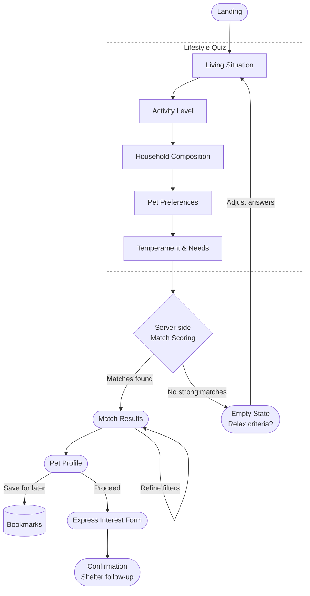

# Pet Adoption Matching — Product Requirements

## Problem Statement

Millions of animals are in shelters and foster homes awaiting adoption. Prospective adopters often lack the tools to identify which animal genuinely fits their lifestyle, leading to poor matches, returns, and unnecessary shelter strain. This product bridges that gap by guiding adopters through a structured, personalized matching experience.

---

## Target Users

- **Primary:** Adults actively considering adopting a pet, ranging from first-time owners to experienced pet owners seeking a specific fit.
- **Secondary:** Shelter staff who benefit from higher-quality, pre-screened adoption inquiries.

---

## High-Level User Flow

### 1. Landing

Entry point that communicates the product's purpose and begins the adoption journey.

**Requirements:**
- Clear primary CTA to begin the matching flow ("Find Your Match", "Start Here", etc.)
- Brief value proposition — explain why matching matters vs. browsing cold inventory
- No login required to start

---

### 2. Lifestyle Quiz

A guided questionnaire that collects adopter preferences and lifestyle signals to power matching. Presented as a series of focused steps, not a long form.

**Requirements:**

#### Living Situation
- Housing type (house with yard, apartment, shared housing)
- Yard access (yes / no)
- Renting vs. owning (some breeds restricted by landlords)

#### Activity Level
- Daily activity level (sedentary, moderate, highly active)
- Hours per day pet would be alone
- Experience with pets (first-time owner, some experience, experienced)

#### Household Composition
- Adults, children (and ages), other pets in the home

#### Pet Preferences
- Species (dog, cat, small animal — scope to at least dog/cat)
- Size preference (small, medium, large, no preference)
- Age preference (puppy/kitten, young adult, adult, senior, no preference)
- Gender preference (male, female, no preference)
- Coat/shedding tolerance (low-shedding preferred, no preference)
- Allergy considerations

#### Temperament & Needs
- Desired energy level in a pet (calm, moderate, energetic)
- Desired affection level (independent, moderate, velcro)
- Openness to pets with special needs or medical history

**UX Requirements:**
- Each step should feel lightweight — one topic per screen or logical grouping
- Allow skipping non-critical steps
- Show progress indicator
- Allow navigating back to change answers
- Answers persist across session (localStorage or equivalent)

---

### 3. Match Results

A curated list of available pets ranked by match quality based on quiz answers.

**Requirements:**
- Display match score or qualitative tier per pet (e.g., "Great Match", "Good Match")
- Each card shows: photo, name, species, breed, age, gender, key temperament tags
- Filter panel to refine results post-quiz (age, size, gender, distance/location)
- Sort options: best match, newest, distance
- Distinguish clearly between "available now" vs. "in foster" status
- Pagination or infinite scroll — do not show all results at once
- Empty state with guidance if no strong matches exist (suggest relaxing criteria)

**Match Logic Requirements (functional, not UI):**
- Hard filters: species, size, housing compatibility (e.g., no large dogs in studios if flagged)
- Soft scoring: activity match, temperament match, household compatibility, adopter experience vs. pet difficulty rating
- Health/special needs: surface pets with medical history only if adopter opted in

---

### 4. Pet Profile

Detailed view for a single pet. Gives the adopter everything they need to decide to pursue adoption.

**Requirements:**
- Photo gallery (multiple images)
- Name, breed, age, gender, weight
- Adoption status (available, pending, adopted)
- Temperament descriptors (3–6 short tags: e.g., "Gentle", "Good with kids", "Leash-trained")
- Full bio written by shelter/foster (personality, quirks, backstory)
- Health status: vaccinations, spayed/neutered, known conditions
- Special needs flag with plain-language explanation if applicable
- Match breakdown: why this pet scored well for this adopter (based on quiz)
- Shelter/foster info: organization name, location, contact
- Primary CTA: "Express Interest" or "Start Application"
- Secondary: "Save for Later" (requires lightweight account or bookmark)

---

### 5. Contact / Application

Connects the adopter with the shelter or foster coordinator to proceed.

**Requirements:**
- Short expression-of-interest form: name, email, phone, message, preferred contact method
- Pre-populate with quiz answers where relevant (e.g., "I have two young children...")
- Confirmation screen with next-steps explanation (shelter will follow up within X days)
- No full adoption application in-product — hand off to shelter's own process
- Optional: allow adopter to save a profile to track multiple pets of interest

---

## Out of Scope (v1)

- Shelter-side inventory management / admin portal
- Full in-product adoption application
- Payment (adoption fees handled by shelter)
- Real-time chat
- User accounts beyond lightweight bookmarking

---

## Key Success Metrics

- Match acceptance rate: % of users who express interest after reaching results
- Return rate: % of adopted pets returned within 90 days (longer-term)
- Quiz completion rate
- Time from landing to first expression of interest

---

## Decisions

1. **Pet inventory source:** Seeded mock data for this challenge.
2. **Match logic:** Server-side with deterministic scoring initially, architected to allow ML-based scoring in the future.
3. **Geographic scope:** National. Both rescues and shelters are supported. Distance from the adopter is a factor in match scoring and filtering.
4. **Quiz fast-track:** No. The tool is purpose-built for adopters seeking the *right* pet, not any pet. All users go through the full quiz.
